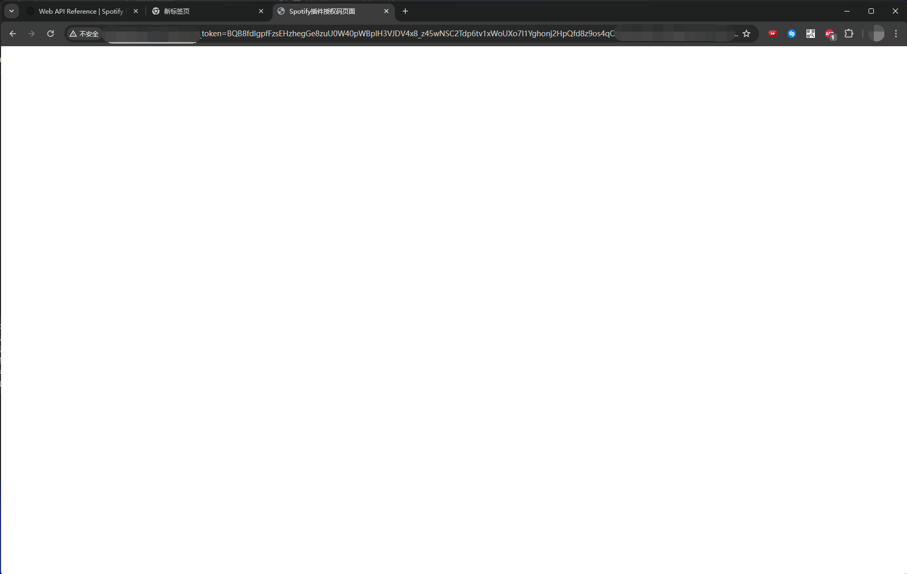
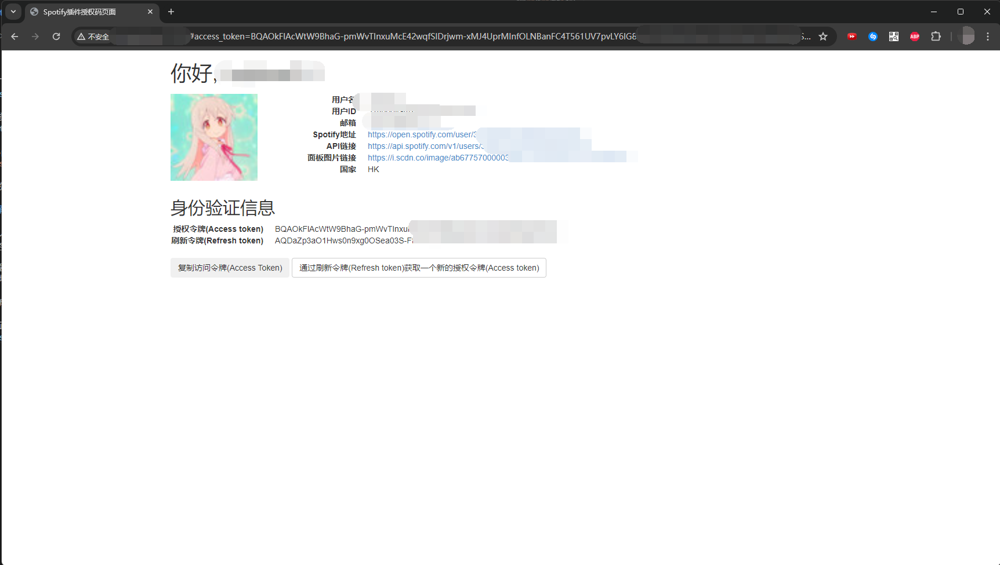

# Spotify-Plugin 常见问题

## 1. 授权登录后, 浏览器执行跳转之后为白屏

### I: Spotify 拒绝授权

情况如下: 

此时, 浏览器URL为: `http://IP:端口/#access_token=<Token>&refresh_token=<Token>&state=`

出现此类情况, 则机器人的所有者`已经配置`ClientID和ClientSecret, `一般情况下`, 此类情况通常发生于 ClientID 和 ClientSecret 生成者与登陆者`非相同账号`的情况

此时 Spotify返回 `access_token`, 但是这类 `access_token` 在请求时会出现错误`(403)`, 被服务器拒绝. 此类 `access_token` 实际上并无法使用

_即使你把地址栏中的 `access_token` 复制下来 输入机器人中也不可用_

### 解决方法

请机器人的所有者登录用于申请 `ClientID` 和 `ClientSecret` 的账号, 并且在 [**Spotify Dashboard**](https://developer.spotify.com/dashboard) 中, 添加你的账号对于机器人所使用App的访问权限

打开机器人所使用的App后, 点击右上角`Settings`, 再找到`User Management`一项, 在`Email`输入框中, 输入使用者Spotify登录邮箱地址 (_App所有者账号不需要填入_) Full Name随意 (_只起到备注的作用_)

输入完成之后, 点击 `Add User` 即可添加这个账号对机器人App的使用权限. 此时, 请登陆者重新登录之后, 即可正常跳转页面.

若还是出现白屏情况, 请尝试`#sp重启授权脚本`并且`重启机器人`后, 访问 [**Spotify 授权管理**](https://www.spotify.com/hk-zh/account/apps/) 撤销对机器人的授权(_一般是显示为App Name_), 之后

以下为正常页面: 

此时, 只需点击`复制访问令牌`, 即可自动复制到设备剪贴板, 发送给机器人后进行添加即可正常使用

## 2. 机器人端提示Access_Token过期

只需发送`#sp登录`, 使用授权脚本进行登录之后`复制一个新的访问令牌`并且发送给机器人 `#sp设置atk<复制的access_token>`后, 即可正常使用

---

## 若有其他问题 请前往 [**Issues**](https://github.com/SmallK111407/spotify-plugin/issues) 进行反馈

