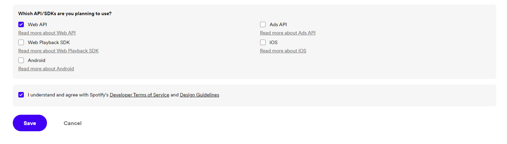

<div align="center">

# Spotify-Plugin 用户指南

</div>

## 1. 创建ClientID和ClientSecret

请登录 [**Spotify Dashboard**](https://developer.spotify.com/dashboard) 并且 [**创建一个应用**](https://developer.spotify.com/dashboard/create)

`App Name` 和 `App Description` 随意填写, 依你所好 不影响后续操作

`Redirect URI` 为登录所需`回调地址`

若您的服务器`拥有公网IP`, 或希望在`非内网环境`下实现登录, 请填写 ```http://您的服务器公网IP地址或域名:任意端口/callback```

若您的服务器`没有公网IP`, 或登录环境为服务器, 则请填写```http://localhost:任意端口/callback``` 

请勾选下方选项的`Web API`一类 并且勾选同意Spotify的协议 点击Save
 

至此, Spotify的 `ClientID` 和 `ClientSecret` 已创建完成

## 2. 配置ClientID和ClientSecret (此步建议私聊操作)

创建完应用之后, 会跳转到 [**Spotify Dashboard**](https://developer.spotify.com/dashboard), 此时, 请选择您刚才创建的`App`, 名字将会以您刚才填入的`App Name`显示

接着, 请点击右上角的`Settings`查看刚才获得`App`的`ClientID` 和 `ClientSecret`

分别复制您的`ClientID` 和 `ClientSecret`后, 转到机器人处

此时, 对机器人发送 `#sp设置cid<您获取的ClientID>` 和 `#sp设置cse<您获取的ClientSecret>` 以设置`ClientID`和`ClientSecret`

同时, 您需要对机器人发送`#sp设置reurl<您设置的Redirect URI>`

设置完成后, 您可使用`#sp登录`来授权您的Spotify账号

